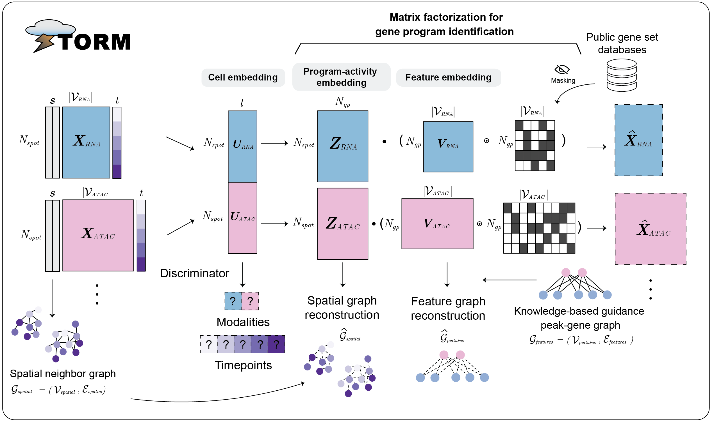

# STORM (Spatial Temporal Omics Regulatory Modeling)

[](https://opensource.org/licenses/MIT)

STORM is a graph-linked unified embedding model for **paired multi-omics
spatial data** with optional **time-resolved** samples. It is derived from
the [GLUE](https://github.com/gao-lab/GLUE) framework (Cao & Gao, *Nat.
Biotechnol.* 2022), with gene-program masking adapted from
[NicheCompass](https://github.com/Lotfollahi-lab/nichecompass) and an
additional temporal-alignment objective.



## Directory layout

```
.
├── storm                    # Main Python package
├── examples                 # End-to-end tutorial notebooks (.ipynb)
├── docs                     # Sphinx documentation sources
├── pyproject.toml           # Python package metadata
├── setup.py                 # setuptools shim
├── LICENSE
└── README.md
```

## Installation

STORM needs a few non-Python tools alongside its Python dependencies
(`bedtools` for `pybedtools`, and `R` + the `mclust` package for the
rpy2-based clustering), so the recommended setup is a single self-contained
conda environment: a thin conda layer (Python, `bedtools`, `R`, compilers)
plus a pinned pip layer (PyTorch, PyG, the single-cell/spatial stack, and
STORM itself).

STORM runs on CPU, but in practice full model training is done on a **GPU**.
The pinned environment below targets **CUDA 12.1, Python 3.10, Linux
x86_64**; a CPU-only recipe follows.

### 1. Create the conda layer

Use a path (`-p`) or a name (`-n`) — the example uses a path so the
environment can live on a shared filesystem:

```sh
conda create -p /path/to/envs/storm -c conda-forge -c bioconda -y \
    python=3.10 "bedtools=2.31" "r-base=4.3" r-mclust \
    gxx_linux-64 gcc_linux-64 gfortran_linux-64
conda activate /path/to/envs/storm
```

`bedtools` is the binary `pybedtools` shells out to; `r-base`/`r-mclust`
back the rpy2 mclust clustering; the compilers let pip build any sdist-only
wheels (e.g. `pybedtools`).

### 2. Install the pinned Python stack (GPU, CUDA 12.1)

From the repository root, with the environment **activated**:

```sh
pip install -r requirements-gpu-cu121.txt
pip install -e .                     # or: pip install storm
```

`requirements-gpu-cu121.txt` is an exact, validated lock of the whole stack
(PyTorch 2.3.0+cu121, the matching PyG `torch-scatter`/`torch-sparse`
wheels, scanpy/anndata/squidpy/scib/decoupler, …). It already carries the
PyTorch and PyG wheel indexes, so no extra flags are needed.

### CPU-only alternative

Replace step 2 with the CPU PyTorch wheels plus the same validated package
versions:

```sh
# CPU PyTorch 2.3.0 + matching PyG companion wheels
pip install torch==2.3.0 torchvision==0.18.0 \
    --index-url https://download.pytorch.org/whl/cpu
pip install torch-scatter==2.1.2 torch-sparse==0.6.18 \
    -f https://data.pyg.org/whl/torch-2.3.0+cpu.html
# The single-cell / spatial stack at validated, mutually-compatible versions
pip install "setuptools<81" "numpy==1.26.4" "scipy==1.14.1" \
    "scikit-learn==1.5.1" "numba==0.60.0" "llvmlite==0.43.0" \
    "scanpy==1.10.2" "anndata==0.10.9" "squidpy==1.4.1" "scib==1.1.5" \
    "decoupler==1.8.0" "dask==2024.12.1" "dask-image==2024.5.3"
pip install -e .                     # or: pip install storm
```

### 3. Verify

```sh
python - <<'PY'
import torch, storm, squidpy, scib, decoupler, pybedtools
print("storm", storm.__version__, "| torch", torch.__version__,
      "| cuda:", torch.cuda.is_available())
PY
```

> **Always `conda activate` the environment before use.** Activation runs an
> isolation hook that sets `PYTHONNOUSERSITE=1` (so packages in
> `~/.local/lib/pythonX.Y/site-packages` cannot shadow the environment) and
> puts the `bedtools` binary on `PATH`. Calling the environment's
> `python` by absolute path *without* activating skips both and will lead to
> `pybedtools` failing to find `bedtools` and possible version clashes.

### Why these versions are pinned

A few constraints are load-bearing and a naive "latest of everything"
install will break:

- **`numpy<2`** — PyTorch 2.3.x, `scib`, and the spatialdata/squidpy stack
  are built against the NumPy 1.x ABI.
- **`decoupler` 1.8.x** — 2.x removed the top-level `get_collectri` STORM
  relies on; 1.6/1.7 hit a `numba>=0.60` incompatibility in their `gsva`
  code.
- **`dask<2025`** — `squidpy` pulls in `spatialdata`, which forces dask's
  *legacy* DataFrame; dask 2025+ removed it.
- **`setuptools<81`** — a transitive `spatialdata` dependency
  (`xarray-schema`) still imports `pkg_resources`, removed in setuptools 81.

## Usage

The end-to-end STORM workflow is split across six tutorial notebooks in
`examples/` that share intermediate artifacts under
`artifacts/storm_tutorial/`:

| # | Notebook | What it does |
|---|----------|--------------|
| 1 | `tutorial_1_preprocess.ipynb`     | Load annotated raw AnnDatas, build prior gene-program masks, run spatial / Moran-I feature selection, construct the guidance graph, emit preprocessed AnnDatas |
| 2 | `tutorial_2_train.ipynb`          | Run `storm.models.fit_STORM` with `PairedSTORMModel`; save a `.dill` checkpoint |
| 3 | `tutorial_3_clustering.ipynb`     | Clustering modes on the shared latent space (CONCAT / JOINT) with spatial + UMAP plots |
| 4 | `tutorial_4_evaluation.ipynb`     | Multi-omics integration (FOSCTTM, MLISI), cross-modality consistency (ARI), cell-type recovery (NMI / ARI) |
| 5 | `tutorial_5_gp_activity.ipynb`    | Project cells into GP-activity latent space, per-cluster Wilcoxon enrichment, cluster × GP heatmaps |
| 6 | `tutorial_6_gp_visualization.ipynb` | Temporal GP analysis on a *separate* 5-timepoint dataset: temporal program modules (R1–R6 / A1–A8) and developmental-time × spatial-bin activity trajectories |

The raw annotated AnnDatas that tutorial 1 reads are provided under
`artifacts/storm_tutorial/raw/`. Tutorials 5 and 6 analyse specific trained
checkpoints whose matching inputs are staged by the
`examples/prepare_reftarg160_inputs.py` and `examples/prepare_5tmp_inputs.py`
helper scripts (run once; see the notebooks for details).

## Documentation

Build the Sphinx docs locally:

```sh
sphinx-build -b html docs docs/_build/html
```

## License

MIT — see [LICENSE](LICENSE).
