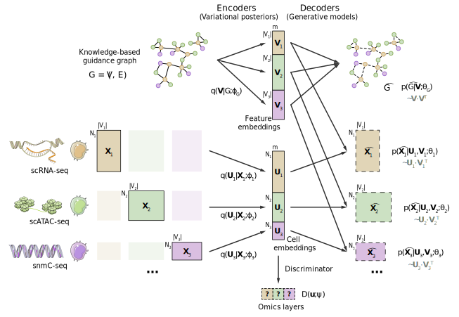

Welcome to STORM's documentation!
=================================

``storm`` (Spatial Temporal multi-Omics Representation Model) is a graph-linked
unified embedding model for paired multi-omics spatial data with optional
time-resolved samples.

STORM is derived from the GLUE framework (Cao & Gao, *Nat. Biotechnol.* 2022)
with gene-program masking adapted from NicheCompass and an additional
temporal-alignment objective. Prior regulatory interactions between omics
features (e.g. RNA genes and ATAC peaks) are compiled into a guidance graph
that orients the multi-omics integration; gene-program priors mask the
decoder so that latent factors map onto interpretable biological programs.

To get started with ``storm``, check out the
:doc:`installation guide <install>` and :doc:`tutorials <tutorials>`.

.. toctree::
   :maxdepth: 2
   :caption: Contents:

   install
   tutorials
   api
   release
   dev
   credits

Indices and tables
==================

* :ref:`genindex`
* :ref:`modindex`
